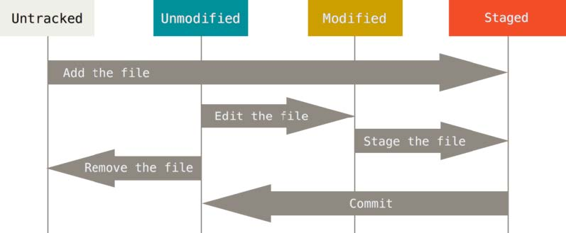

# Pro Git Notes

> **key words**: Distribute, Local VCS, Snapshot Not Difference

## what is `Git`

### three states

- `committed`已提交: data is safely stored in local database.
- `modified` 已修改: files have been changed but not committed to local database.
- `staged` 已暂存: marked a modified file in its current version to go the next commit snapshot.


### `Git` Basics

#### Getting a Git Repository

two ways:

- `git init`: create local repository
- `git clone`: obtain an existing repository from remote

#### Record Changes to the Repository

lifecycle of the status of file:


use `git status` to check the status of files, `git status -s` or `git status --short` to check the status with shorter outputs.

- untracked: new file
- changes to be commited: files which are added to repo without more modification
- changes not staged for commit: files which are modified after being added to repo

#### `.gitignore` file

- 所有空行或者以 `#` 开头的行都会被 Git 忽略
- 可以使用标准的 `glob` 模式匹配
- 匹配模式可以以（/）开头防止递归 (`/TODO` only ignore `TODO` file in current directory)
- 匹配模式可以以（/）结尾指定目录
- 要忽略指定模式以外的文件或目录，可以在模式前加上惊叹号`!`取反, (`!lib.a` statement for not ignoring file `lib.a`)

所谓的 glob 模式是指 shell 所使用的简化了的正则表达式。

- `*`匹配零个或多个任意字符
- `[abc]` 匹配任何一个列在方括号中的字符（这个例子要么匹配一个 `a`，要么匹配一个 `b`，要么匹配一个 `c`）
- `?`只匹配一个任意字符
- 如果在方括号中使用短划线分隔两个字符，表示所有在这两个字符范围内的都可以匹配（比如 `[0-9]` 表示匹配所有 `0` 到 `9` 的数字）。 使用两个星号`*`表示匹配任意中间目录，比如`a/**/z` 可以匹配 `a/z`, `a/b/z` 或 `a/b/c/z`等。

#### 暂存文件

`git add PATH` PATH是要加入暂存的路径或者文件

取消暂存: `git reset HEAD <file>`

#### 查看已暂存和未暂存的更改

- `git diff`: 尚未暂存的文件更新了哪些部分
- `git diff --cached` or `git diff --staged`: 当前文件和暂存区快照的差异

撤销对文件的更改/还原上一次提交的状态: `git checkout -- <file>`
原理是从仓库的旧版本拷贝一个文件来覆盖

#### 提交更新

`git commit -m "update info"`

use `-a` option to skip stage
`git commit -a -m "update info"`

撤销提交/改正提交
`git commit -amend`
如果提交过后没有修改，则只更新提交信息
如果有修改，如加入某些文件：

```bash
git commit -m 'initial commit'
git add forgotten_file
git commit --amend
```

则第二次提交会覆盖第一次提交

#### 移除文件

从Git的已追踪文件清单移除文件：`git rm FILENAME`，此文件不再纳入版本管理。如果删除之前修改过并且已经放到暂存区域的话，则必须要用强制删除选项 `-f`
如果想让文件保留在磁盘，但是并不想让 Git 继续跟踪。如：不小心把一个很大的日志文件或一堆 .a 这样的编译生成文件添加到暂存区时，`git rm --cached FILENAME`
Git可以使用自带的glob，不需要shell的帮助所以在使用glob时需要加上`\`: `git rm \*.a` 删除以`.a`结尾的文件

#### 移动文件

重命名文件或移动文件位置
`git mv file_from file_to`
等效于

```bash
mv file_from file_to
git rm file_from
git add file_to
```

#### 查看提交历史

- `git log` 按时间列出所有的更新
- `git log -p` 显示每次提交的差异
- `git log --stat` 只显示每次提交的简略信息
- `git log --graph` 左侧有图形展示分支合并历史
- `git log --pretty=FORMAT` 自定义输出格式
`FORMAT`的值包括：
    - `oneline`
    - `short`
    - `full`
    - `fuller`
    - `format:"%h - %an, %ar : %s"` 输出 `ca82a6d - Scott Chacon, 6 years ago : changed the version number`
        |选项|说明|
        |:-:|:-:|
        |`%H`|提交对象（commit）的完整哈希字串||
        |`%h`|提交对象的简短哈希字串|
        |`%T`|树对象（tree）的完整哈希字串|
        |`%t`|树对象的简短哈希字串|
        |`%P`|父对象（parent）的完整哈希字串|
        |`%p`|父对象的简短哈希字串|
        |`%an`|作者（author）的名字|
        |`%ae`|作者的电子邮件地址|
        |`%ad`|作者修订日期（可以用 --date= 选项定制格式）|
        |`%ar`|作者修订日期，按多久以前的方式显示|
        |`%cn`|提交者（committer）的名字|
        |`%ce`|提交者的电子邮件地址|
        |`%cd`|提交日期|
        |`%cr`|提交日期，按多久以前的方式显示|
        |`%s`|提交说明|
        这里*作者*是实际作出修改的人，*提交者*是最后将此工作提交到仓库的人

`git log` 常用选项：

|选项|说明|
|:-:|:-:|
|`-p`|按补丁格式显示每个更新之间的差异。|
|`--stat`|显示每次更新的文件修改统计信息。|
|`--shortstat`|只显示 `--stat` 中最后的行数修改添加移除统计。|
|`--name-only`|仅在提交信息后显示已修改的文件清单。|
|`--name-status`|显示新增、修改、删除的文件清单。|
|`--abbrev-commit`|仅显示 SHA-1 的前几个字符，而非所有的 40 个字符。|
|`--relative-date`|使用较短的相对时间显示（比如，“2 weeks ago”）。|
|`--graph`|显示 ASCII 图形表示的分支合并历史。|
|`--pretty`|使用其他格式显示历史提交信息。可用的选项包括 oneline，short，full，fuller 和 format（后跟指定格式）。|

`git log` 输出限制

|选项|说明|
|:-:|:-:|
|`-(n)`|仅显示最近的 n 条提交|
|`--since`, `--after`|仅显示指定时间之后的提交。|
|`--until`, `--before`|仅显示指定时间之前的提交。|
|`--author`|仅显示指定作者相关的提交。|
|`--committer`|仅显示指定提交者相关的提交。|
|`--grep`|仅显示含指定关键字的提交|
|`-S`|仅显示添加或移除了某个关键字的提交|

- `-2` 只显示前两条
- `git log --since=2.weeks` 和 `git log --until="2018-01-15"` 具体某一天或者相对多久以前
- `git log --author=NAME` 根据作者名过滤，`git log --grep=PARA` 在提交说明中顾虑关键词，两个要同时匹配需要加上 `--all-match` 选项。
- `git log -Sstring_name` 列出添加或移除某些字符串的提交

#### 远程仓库的使用

##### 查看远程仓库

`git remote`: 返回Alias
`git remote -v`: 返回Alias和URL

`git remote show [remote-name]`
如 `git remote show origin`

##### 添加远程仓库

`git remote add <ALIAS> <URL>`: 添加地址为URL的远程仓库，名字为ALIAS(方便调用)

##### 从远程仓库抓取

> `clone`会自动添加远程仓库并命名为

`git fetch [remote-name]`: 执行后本地仓库会有远程仓库**所有分支**的副本/引用，可以随时合并或查看。并不会自动合并或修改当前工作。
与`pull`的区别：**`fetch`只拉去副本，不合并，`pull`会拉去远程副本并与本地仓库合并**。

##### 推送到远程仓库

`git push [remote-name] [branch-name]`
`git push` 默认推送到 `origin` 的 `master` 分支

##### 远程仓库的移除与重命名

重命名：`git remote rename <old-name> <new-name>`，同时修改对应分支的名字

移除：`git remote rm <remote-name>`

##### 打标签

> 给历史中的某一个提交打上标签

列出标签：

- `git tag`
- `git tag -l 'v1.8.5*'`: 列出1.8.5系列

创建标签

> 轻量标签(lightweight) 和 附注标签(annotated)
> 赋值标签在Git数据库里是一个完整对象，有打标签者的名字、邮件、修改日期、标签信息等
> 轻量标签则没有

附注标签: `git tag -a v1.4 -m 'my version 1.4'`
可以通过 `git show v1.4` 查看

轻量标签不需要提供 `-a`, `-s`或者`-m`选项，只需要标签名字：`git tag v1.5-lw`

后期打标签: `git tag (-a) v1.2 CHECKSUM`, `checksum`处填入对应的commit的checksum就好

##### 共享标签

默认标签不会被推送到远程服务器，需要显式指定：`git push [remote-name] [tag-name]`， 如：`git push origin v1.5`
或者使用：`git push origin --tags` 推送全部标签

##### 签出标签

不能真的签出一个标签，只是在特定标签上创建一个新分支
`git checkout -b [branch-name] [tag-name]`

#### `Git` 别名

`git config --global alias.[xx] [option-name]`
例：

```bash
git config --global alias.unstage 'reset HEAD --'
# 使以下两个命令等价
git unstage fileA
git reset HEAD -- fileA
# OR
git config --global alias.last 'log -1 HEAD'
# 使以下两个命令等价
git last
git log -1 HEAD
```

